# talk_to_repo_example

### Created by Phil Wilmarth, November 9, 2019.

Example of turning a Powerpoint talk into a repo `README.md`. This is an example inside an example. The main repository is about how to create a repository to host a presentation from a scientific meeting. This `README.md` will have images, text, and links to show the steps involved.

The example talk used here is a truncated talk from the 2018 Cascadia Proteomics Symposium about using Jupyter notebooks in proteomics work. There is a `talk_example` folder that has the shortened talk turned into a useful repository. The folder has a `README.md` file that functions as a web page because Github uses `README.md` file like websites use `index.html` files. The images used in the   `README.md` file are in an `images_talk` folder. The PowerPoint file of the truncated talk (`Cascadia_2018_short.pptx`) is also present. The full presentation is [located here](https://github.com/pwilmart/Cascadia_2018).

There are different ways to organize things at Github in this context. Separate repositories for each meeting presentation could be created. Alternatively, a single meeting repository could be created and each presentation added as a subfolder.

Turning talks or posters into repositories is relatively straightforward **after** you have done it a few times. There are quite a few things that have to be learned to get started. Learning by doing is certainly an option. A little study can go a long way here, though. There is a lot of online material available and this list just scratches the surface:

- [Git](https://en.wikipedia.org/wiki/Git)
  - [Git Pro book](https://git-scm.com/book/en/v2)
  - [Git tutorial](https://git-scm.com/docs/gittutorial)
  - [Git documentation](https://git-scm.com/doc)
  - [Git downloads](https://git-scm.com/downloads)
  - [Github](https://help.github.com/en), [Bitbucket](https://confluence.atlassian.com/bitbucket/bitbucket-cloud-documentation-221448814.html), and [GitLab](https://about.gitlab.com/get-started/) also have help
- [Github](https://kinsta.com/knowledgebase/what-is-github/)
  - [Github help](https://help.github.com/en/github)
  - [Github guides](https://guides.github.com)
- [Markdown](https://en.wikipedia.org/wiki/Markdown)
  - [Guide to Github markdown](https://guides.github.com/features/mastering-markdown/)
  - [Adam Pritchard's Markdown Cheatsheet](https://github.com/adam-p/markdown-here/wiki/Markdown-Cheatsheet)
- [Atom text editor](https://atom.io/)

The example will be using Github, so you might want to get an account set up. The other Git hosting services (Bitbucket and GitLab) can probably do something similar. If you do some shallow reading about Github, you might be tempted to try and do things via the web interface. That will end in frustration. Github is really a hosting/sharing service for your local data repositories. It can support large and complicated projects. Using Github when you are a single developer can seem like a big ask.

The use pattern goes like this:
- create new projects at Github using the web interface
- clone the repository to your local machine
- manage the content in the local repository
  - add files
  - edit files
  - edit README.md files
  - keep it all under version control with Git
  - push updated content back to Github for hosting

I use the command line for Git on my local iMac. I do not like the command line much. I have looked at some local GUI Git options, but I find them harder to learn than the handful of Git commands that I need. Your milage may vary...

Even if you do not plan to write and share actual code, the web hosting features of Github are pretty useful. It is worth the time investment to setup Git locally to take advantage of Github. Creating websites from scratch is probably more involved, since version control is often used in that context. You would probably have to learn Git anyway.

---


We will assume you have set up your Github account and have a main page that looks like mine. You can add your favorite mug shot, some profile propaganda, etc. You can have up to 6 repositories pinned to the main page. In the upper right corner is the `+` button. Use that button to add a new repository to hold your meeting presentation content.

---


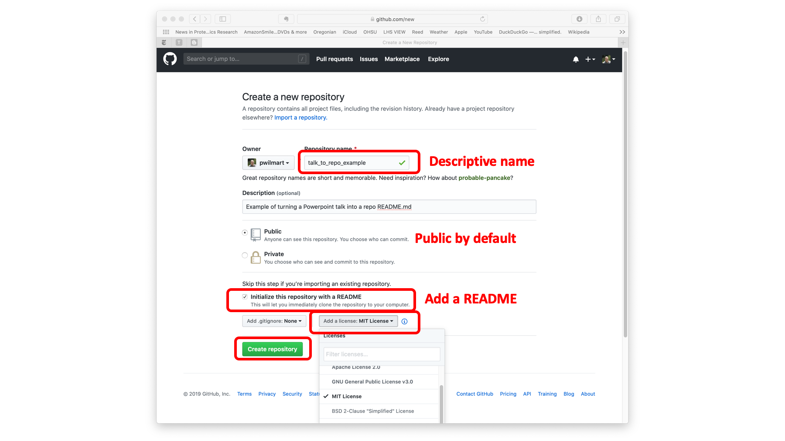

When you create a new repository, you have to specify a few things. Pick an informative name for the repository. It is best to avoid spaces (underscores are a good replacement for spaces) in the name. Add a one sentence description (you can add and edit these things later, too). Github is all about sharing and repositories are public by default. We want to have a `README.md` file and having it created when the repository is set up is handy (it can be added later, too). Sharing content **always** has some legal consequences. You do not have to specify an [open source license](https://choosealicense.com) to create the repository, and you may have some institutional limitations. The MIT license is very permissive and I usually go that route. Your level of paranoia may differ from mine. Click the big green button to create the repository.

---

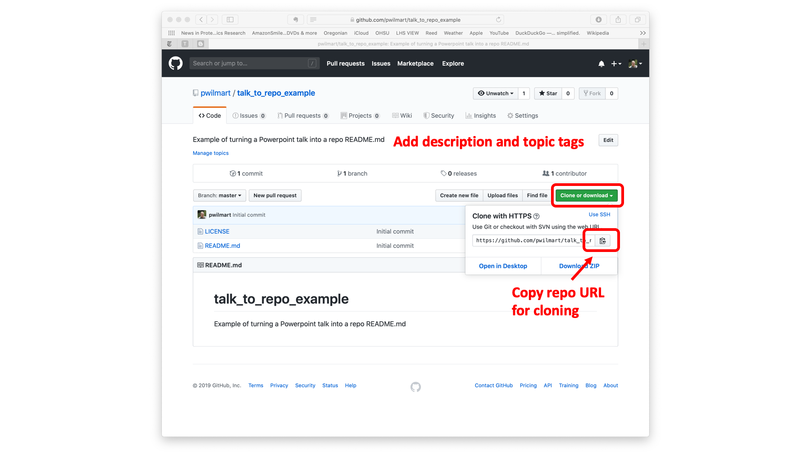

The web page for the repository will open. We have two files: the license file and the `README.md` Markdown file. The Markdown file is rendered as web content automatically and appears below the list of files. So far, we just have a main header and our one-line description. The big green `Clone or download` button will give us the URL so we can clone the repository to our local machine.

---

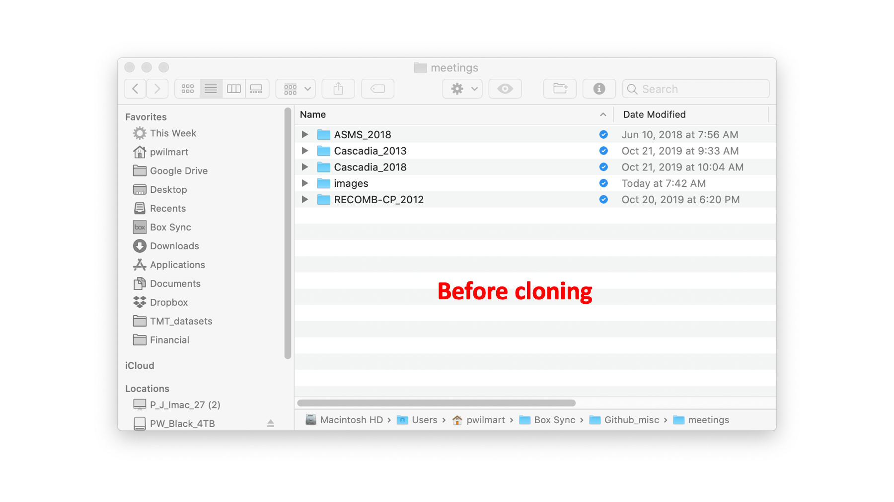

At the bottom of this Finder window on my iMac, you can see the file path. I am lazy, so I keep my Git repositories in a Box Sync folder. That keeps my iMac, a laptop, and some work computers in sync. I could use Github to sync files between computers, but that is less automatic. I have a `Github_misc` folder and a `meetings` subfolder. Each folder here is a separate Github repository (except `images`, which is collecting these screen shots).

---

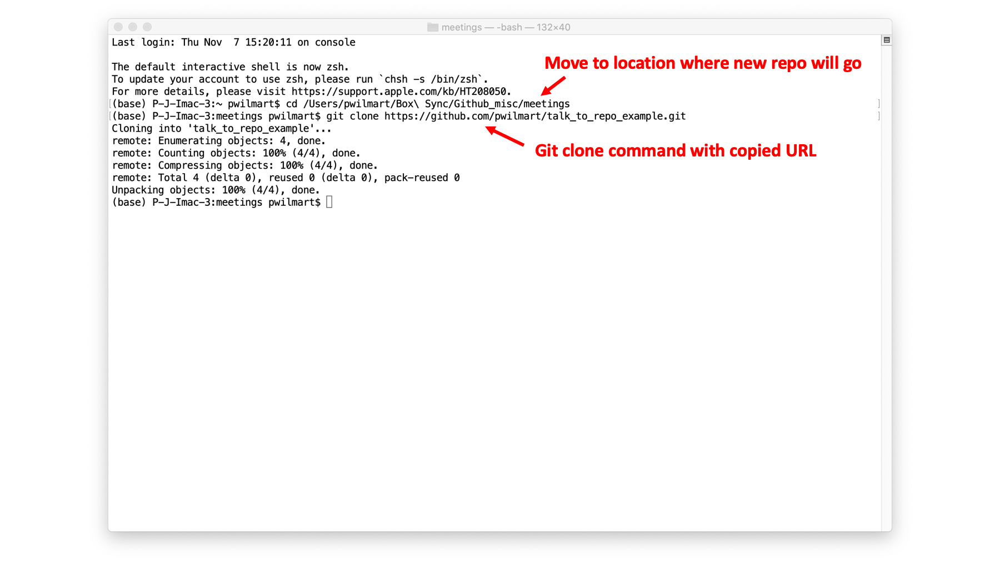

I need to open a `Terminal` window for command line commands on the Mac. I have to navigate to the `...Github_misc/meetings` folder. I want to clone the `talk_to_repo_example` repository in that location. The command is `git clone <URL>`, where the URL was copied from Github. When that command is executed, we will see some status details from Git as the files are downloaded and the repository is created.

---

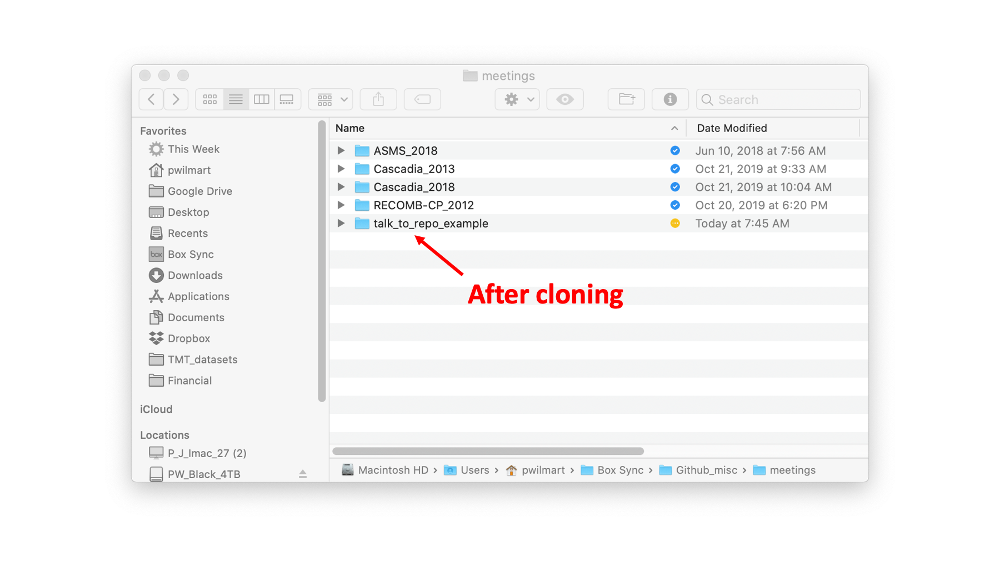

If we go back to the Finder window, we will see the new repository.

---

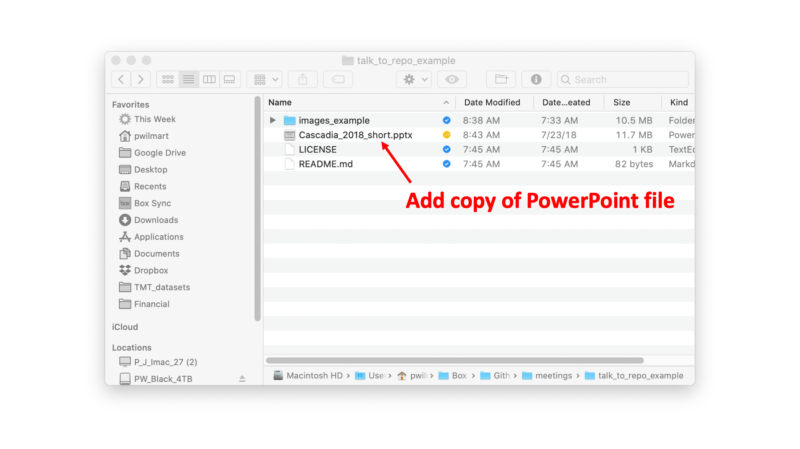

Inside the repository, we will have the license and README files (I have an images folder here because I am accumulating these screen shots). We can add a copy of the PowerPoint presentation that we want to make into a README.md and have available for download. This example is 10 slides of the 23 slide talk. The full presentation was 80 MB because of the graphics content.

---

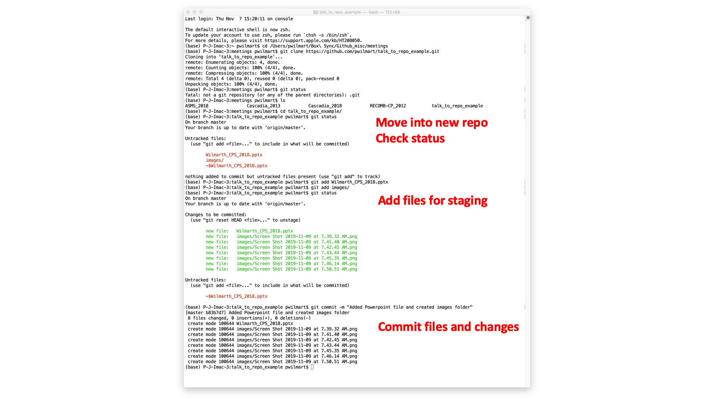

First and foremost, Git is a version control system. We can commit our work as we go so that we are protected from file loss, ourselves, etc. We have to navigate to our new repository so that Git knows what files to operate on. The commands for the basic Git usage are:

- check the status (do this a lot)
- add files accordingly
  - non-tracked files/folders are in red
  - tracked files/folders are in green after they have been added
  - we may not want to commit all files every time
- commit the files/changes

When you are working on a repository, it is good to just keep an open command line window hanging around on your desktop.

---


Open up the PowerPoint presentation.

---

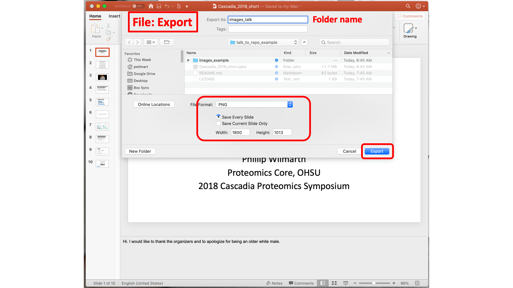

In the `File` menu, there is an `Export...` command. That will let you turn the slides into `PNG` images that we can link to from the README.md file. We want `PNG` as the export format. We want to convert **all** of the slides into `PNG` files. You might need to do some trial and error on the image sizes (in pixels) to see what the quality is like. Bigger sizes might look better when scaled down at the expense of larger file sizes.

> You can export one slide at a given size, link to it in a `README.md` file, commit and push back to Github. View the `README.md` from a web browser and check the image quality. Try to find the smallest size that give the desired image quality. Do the full export with the size that worked best.

We can also name the folder where the images will be written (`images_talk`).

---

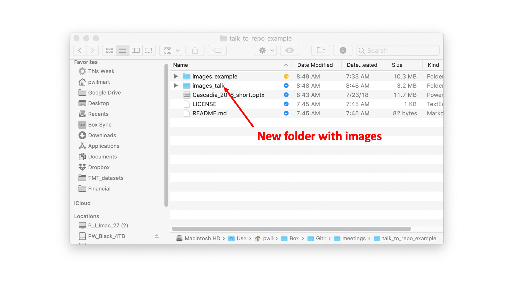

We will have the new folder with the images in our "site".

---

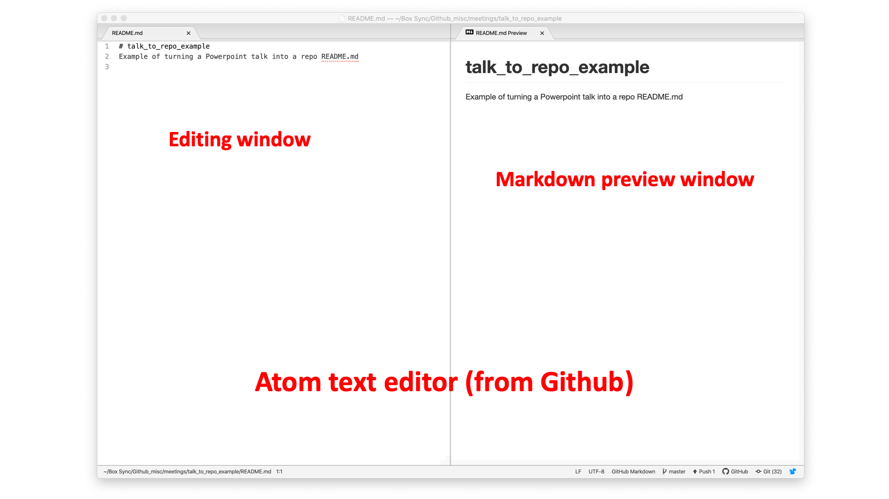

Now, we want to add links to those images in the `README.md` file. Hopefully, you also have nice notes for each slide to serve as captions for each image. The [Atom text editor](https://atom.io/) is a nice text editor from Github and it is very handy for editing Markdown. We want to open the `README.md` file with Atom. There is a Markdown preview mode (`SHIFT+CONTROL+M` key combination on the Mac) that will give us side-by-side *editor* and *preview* windows.

---

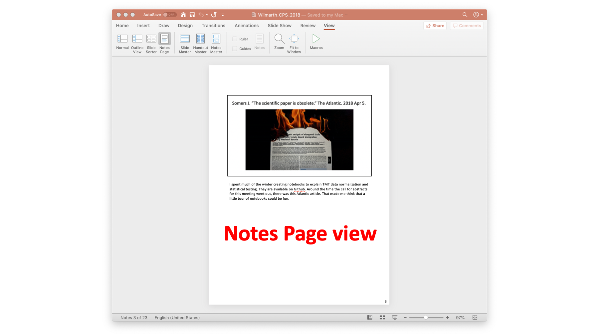

Back in PowerPoint, switch to `Notes Page` view. This will give us the slide images and the text of the notes. We will be copying the notes text and pasting it into the `README.md` file.

---

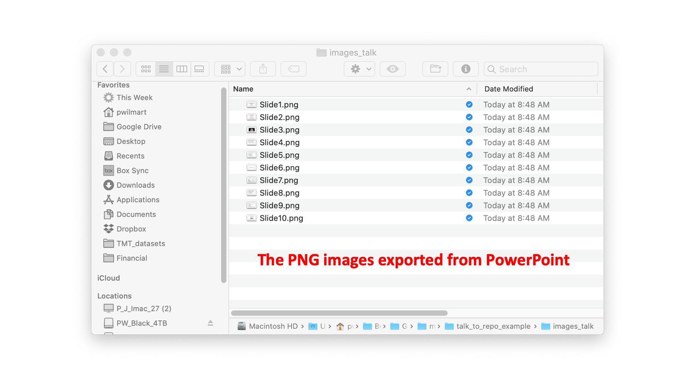

Check the relative path (`images_talk`) and the filenames for the exported `PNG` files. The filenames are the default from PowerPoint.

---
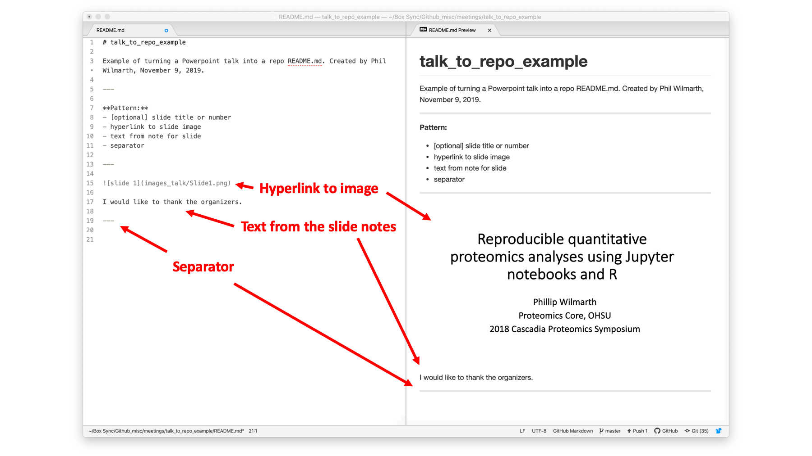

I like [this cheatsheet](https://github.com/adam-p/markdown-here/wiki/Markdown-Cheatsheet) for Github Markdown. Most Markdown dialects are similar for most things but can have some unique options. The format for image links is ``. We can use a pattern that is easy to copy/paste/edit: ``, where X goes from 1 to 10 for this example. We will use a repeating block of Markdown:

```


Text from Notes for slide X.

---
```

We will just copy/paste to repeat the block and edit it accordingly.

---


We can get the Notes text from the `Notes Page` view in PowerPoint.

---
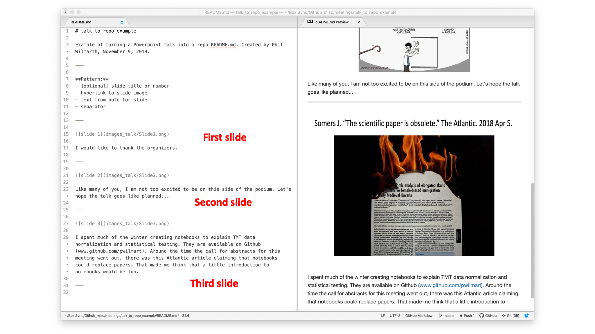

We just repeat and edit the Markdown blocks for each slide in the presentation.

---
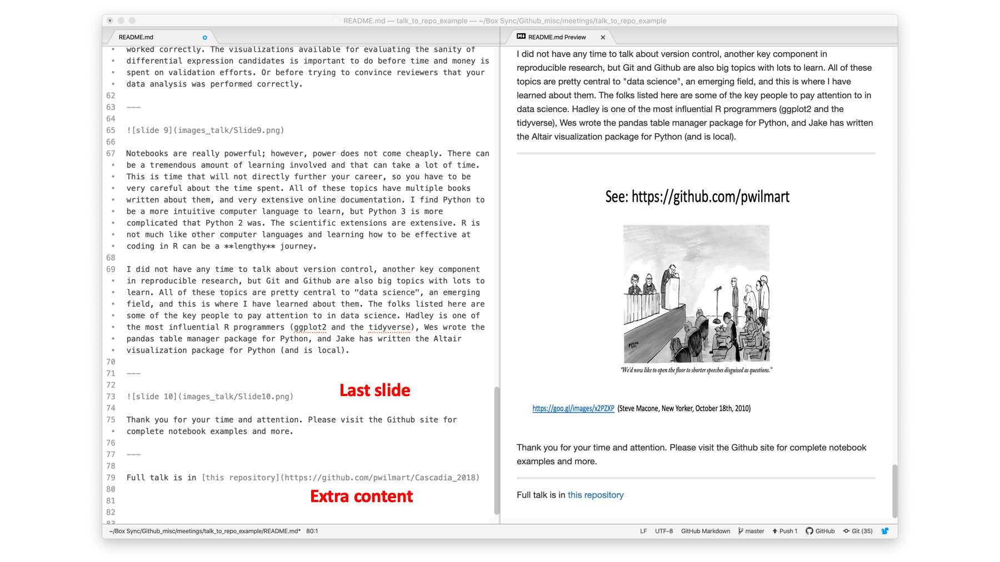

We can enhance the Markdown if we want to add hyperlinks, lists, etc. Markdown is a little more expressive than the Notes text in PowerPoint, so go crazy. Do not forget to save the changes to the `README.md` file in Atom.

---
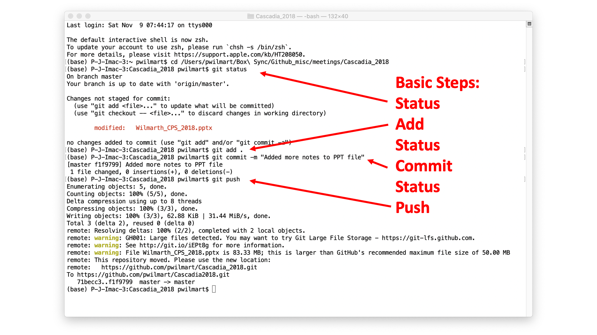

We need to get the updated `README.md` file committed to the repository and get the updated repository **pushed** back to Github. We check the repository status, add files accordingly, commit the changes, then push the changes back up to Github. You may have to provide your Github username and password to complete the push. The keychain on my Mac remembers my login details.

---
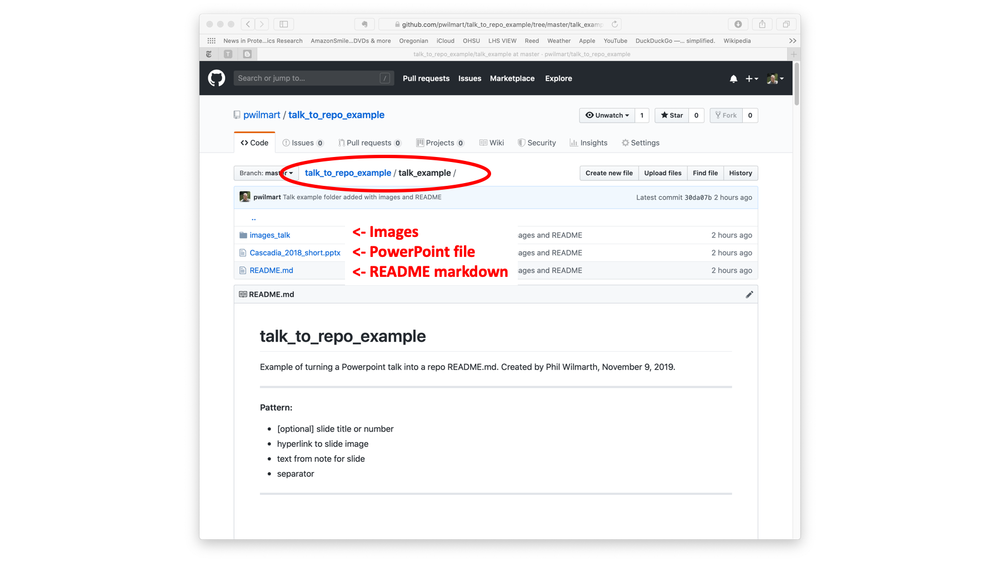

We can update the browser and see what the repository at Github looks like. Here, I have set up the presentation example as a subfolder within this broader example. The subfolder has the PowerPoint file, the `README.md` file, and a subfolder of slide images. The `README.md` Markdown renders as web content automatically at Github.  

---
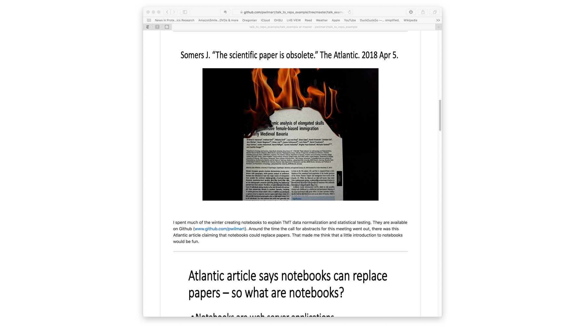

We have our presentation hosted on the web in an easy to read format. This is a pretty generic method using some basic features of PowerPoint, a little file organization, a little Markdown, Atom, some basic Git, and Github.

---
